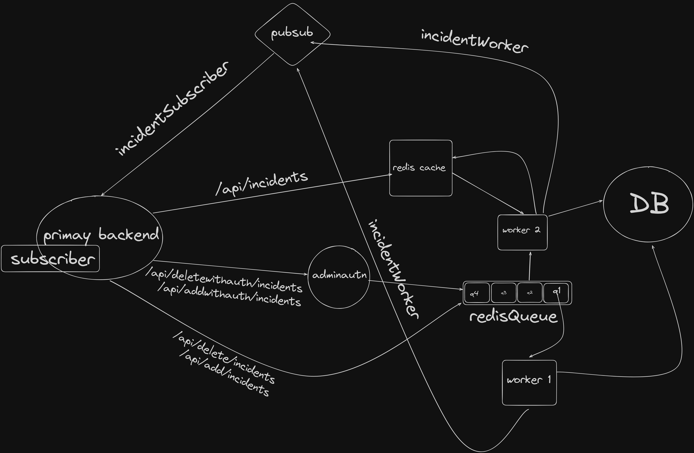

# 📄 Log API

Welcome to **Log API** — a lightweight, scalable, and production-ready Node.js API built with Express, TypeScript, PostgreSQL, Redis, Prisma, and Docker.

This API is designed to log, display, add, and delete incident records with optional admin authentication.

---

## ✨ Features

* ✅ View all incidents
* ✅ View a specific incident by ID
* ✅ Add a new incident (with or without admin authentication)
* ✅ Delete an incident (with or without admin authentication)
* ✅ Built with Express.js and TypeScript
* ✅ PostgreSQL database with optimized indexing for faster querying
* ✅ Redis caching for faster responses
* ✅ Fully Dockerized for easy setup

---

## 🛠 Tech Stack

| Technology   | Purpose                        |
| ------------ | ------------------------------ |
| Node.js      | Server runtime                 |
| Express.js   | Web framework                  |
| TypeScript   | Type safety                    |
| PostgreSQL   | Relational database            |
| Prisma       | ORM (Optimized with indexes)   |
| Redis        | Caching and quick storage      |
| Docker       | Containerization               |

---

## 🖼️ System Design Reference

📷   
*(Example: basic flowchart showing Client → API Server → DB + Redis.)*

---

## 🚀 Getting Started

### 1. Prerequisites

Ensure you have Docker and Docker Compose installed.

⚡ **Note:** You **do not need Node.js** installed locally to run the project as everything runs in Docker containers.

---

### 2. Clone the Repository

```bash
git clone https://github.com/yeswanth08/log-api.git
cd log-api
```

---

### 3. Install Dependencies and Build

Run the following Docker Compose command to build and start the containers:

```bash
docker-compose up --build
```

This will:

* Set up Docker containers
* Install dependencies inside the containers
* Build the TypeScript code
* Start Node.js, PostgreSQL, and Redis services
* completes the seeding

Access the API at: [http://localhost:3000](http://localhost:3000)


## 📚 API Documentation

| Method   | Route                               | Description                         | Authorization   |
| -------- | ----------------------------------- | ----------------------------------- | --------------- |
| GET      | `/api/incidents`                    | Retrieve all incidents              | ❌ No           |
| GET      | `/api/incidents/:id`                | Retrieve incident by ID             | ❌ No           |
| POST     | `/api/add/incidents`                | Add new incident                    | ❌ No           |
| POST     | `/api/addwithauth/incidents`        | Add new incident (admin)            | ✅ Yes          |
| DELETE   | `/api/delete/incidents/:id`         | Delete incident                     | ❌ No           |
| DELETE   | `/api/deletewithauth/incidents/:id` | Delete incident (admin)             | ✅ Yes          |

---

## 🛠 Example API Usage

### ✅ Testing with Postman or API Client

If you're facing issues with the length or formatting of `curl` commands, you can use **Postman** or another API client to test the API.

### 1. **Get all incidents**

* **Method**: `GET`
* **URL**: `http://localhost:3000/api/incidents`
* **Steps**:

  1. Open Postman or your preferred API client.
  2. Select `GET` from the dropdown.
  3. Enter the URL `http://localhost:3000/api/incidents` in the address bar.
  4. Click **Send**.

### 2. **Get incident by ID**

* **Method**: `GET`
* **URL**: `http://localhost:3000/api/incidents/{id}`

  * Replace `{id}` with the actual incident ID.
* **Steps**:

  1. Open Postman.
  2. Select `GET` from the dropdown.
  3. Replace `{id}` with an actual incident ID in the URL.
  4. Click **Send**.

### 3. **Add new incident (No Auth)**

* **Method**: `POST`
* **URL**: `http://localhost:3000/api/add/incidents`
* **Headers**:

  * `Content-Type`: `application/json`
* **Body**:

  * Select the `raw` option and set the body type to `JSON`.
  * Paste the following JSON:

    ```json
    {
      "name": "admin",
      "password": "test@123",
      "title": "Investigate API response",
      "description": "Incident description here.",
      "severity": "MEDIUM"
    }
    ```
* **Steps**:

  1. Open Postman.
  2. Select `POST` from the dropdown.
  3. Enter the URL `http://localhost:3000/api/add/incidents`.
  4. Go to the **Headers** tab and add `Content-Type: application/json`.
  5. Go to the **Body** tab, select `raw`, and paste the JSON request body.
  6. Click **Send**.

### 4. **Add new incident (Admin Auth)**

* **Method**: `POST`
* **URL**: `http://localhost:3000/api/addwithauth/incidents`
* **Headers**:

  * `Content-Type`: `application/json`
  * **Authorization**: (if needed, provide your auth credentials here)
* **Body**:

  * Same as the previous body, but this endpoint may require authorization.
* **Steps**:

  1. Open Postman.
  2. Select `POST` from the dropdown.
  3. Enter the URL `http://localhost:3000/api/addwithauth/incidents`.
  4. Go to the **Headers** tab and add `Content-Type: application/json`.
  5. Add **Authorization** headers (if required).
  6. Go to the **Body** tab, select `raw`, and paste the JSON request body.
  7. Click **Send**.

### 5. **Delete incident (No Auth)**

* **Method**: `DELETE`
* **URL**: `http://localhost:3000/api/delete/incidents/{id}`

  * Replace `{id}` with the actual incident ID to delete.
* **Steps**:

  1. Open Postman.
  2. Select `DELETE` from the dropdown.
  3. Replace `{id}` with the actual incident ID in the URL.
  4. Click **Send**.

### 6. **Delete incident (Admin Auth)**

* **Method**: `DELETE`
* **URL**: `http://localhost:3000/api/deletewithauth/incidents/{id}`

  * Replace `{id}` with the actual incident ID to delete.
* **Headers**:

  * `Content-Type`: `application/json`
* **Body**:

  * Add the following JSON for admin authentication:

    ```json
    {
      "name": "admin",
      "password": "test@123"
    }
    ```
* **Steps**:

  1. Open Postman.
  2. Select `DELETE` from the dropdown.
  3. Enter the URL `http://localhost:3000/api/deletewithauth/incidents/{id}`.
  4. Go to the **Headers** tab and add `Content-Type: application/json`.
  5. Go to the **Body** tab, select `raw`, and paste the admin authentication JSON.
  6. Click **Send**.

---

### ✅ Testing with cURL

1. **Get all incidents**

```bash
curl -X GET http://localhost:3000/api/incidents
```

2. **Get incident by ID**

```bash
curl -X GET http://localhost:3000/api/incidents/{id}
```

3. **Add new incident (No Auth)**

```bash
curl -X POST http://localhost:3000/api/add/incidents\
  -H "Content-Type: application/json"\
  -d '{
        "name": "admin",
        "password": "test@123",
        "title": "Investigate API response",
        "description": "Incident description here.",
        "severity": "MEDIUM"
      }'
```

4. **Add new incident (Admin Auth)**

```bash
curl -X POST http://localhost:3000/api/addwithauth/incidents\
  -H "Content-Type: application/json" \
  -d '{
        "name": "admin",
        "password": "test@123",
        "title": "Investigate API response",
        "description": "Incident description here.",
        "severity": "MEDIUM"
      }'
```

5. **Delete incident (No Auth)**

```bash
curl -X DELETE http://localhost:3000/api/delete/incidents/{id}
```

6. **Delete incident (Admin Auth)**

```bash
curl -X DELETE http://localhost:3000/api/deletewithauth/incidents/{id}\
  -H "Content-Type: application/json"\
  -d '{
        "name": "admin",
        "password": "test@123"
      }'
```


## 🧩 Project Structure

```bash
log-api/
├── docker-compose.yml
├── package.json
├── tsconfig.json
├── prisma/
│   ├── schema.prisma
│   ├── seeder.ts
├── src/
│   ├── server.ts
│   ├── routes/
│   │   └── rootRouter.ts
│   ├── controllers/
│   │   ├── addIncidents.ts
│   │   ├── deleteIncidents.ts
│   │   ├── displayIncidents.ts
│   ├── middlewares/
│   │   └── admin.validate.middleware.ts
```

---

## 🐳 Dockerized Services Overview

| Service       | Port   | Purpose             |
| ------------- | ------ | ------------------- |
| PostgreSQL    | 5432   | Database            |
| Redis         | 6379   | Cache Storage       |
| Node.js API   | 3000   | Application Server  |

✅ Each service has automatic health checks (`pg_isready`, `redis-cli PING`, `curl` API server check).

---

## ⚡ Database Optimization

* Indexes created automatically via Prisma migrations.
* Highly optimized querying, even as data grows.

---

## ✅ Health Checks

* PostgreSQL: `pg_isready`
* Redis: `redis-cli PING`
* API Server: `curl http://localhost:3000`

---

## ⚙️ Common Docker Commands

| Task                           | Command                                 |
| ------------------------------ | --------------------------------------- |
| Build & Start containers       | `docker-compose up --build`             |
| Stop containers                | `docker-compose down`                   |
| View container logs            | `docker-compose logs -f`                |

---

## 📢 Important Notes

* Prisma Client auto-generated at build.
* `--legacy-peer-deps` used for smooth `npm install`.
* TypeScript compilation and database seeding handled during startup.
* CORS enabled for frontend integration.
* Indexed PostgreSQL database for faster search performance.

---

## 🤝 Contributing

Contributions are welcome!

* Fork the repo.
* Create a feature branch.
* Make your improvements.
* Submit a pull request 🚀

---

## 🛠 Troubleshooting and Recovery for Docker Engine Issues

### 1. Fix "attribute version is obsolete" Warning

* Open `docker-compose.yml`
* **Remove** the `version:` line.

### 2. Fix "unable to get image 'postgres:15'" Error

* Restart Docker engine:
    - Windows: Right-click Docker icon → Restart Docker
    - Linux/macOS:

```bash
sudo systemctl restart docker
```

### 3. Check Docker Daemon Health

```bash
docker info
```

* Confirm it’s healthy and running.

### 4. Check Docker API Version Compatibility

```bash
docker version
```

* Match API versions if needed.

### 5. Full Docker Restart Commands (Linux)

```bash
sudo systemctl stop docker
sudo rm -rf /var/run/docker.sock
sudo systemctl start docker
docker info
```

---

## ✨ Author

**Log API**  
by **Dadi Yeswanth Chinnamnaidu**  
Registration No: **12210320**

---
